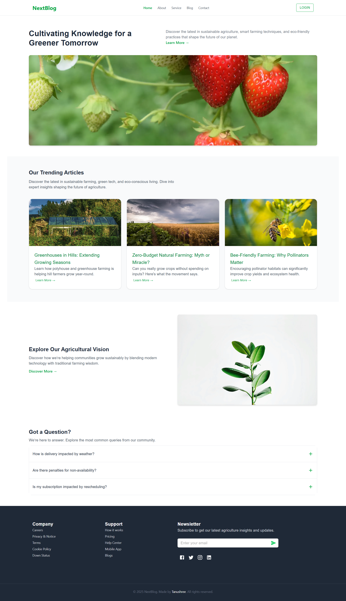

# NextBlog

**NextBlog** is a full-stack blogging platform built with Next.js 15, React 19, MongoDB, and Tailwind CSS. It is designed for publishing agriculture and sustainability-related blog content with a responsive, clean, and accessible user interface.

## Screenshots

### Dashboard



---

## Features

- JWT-based authentication (Login/Signup)
- Create, edit, and delete blogs using Tiptap rich text editor
- Comment system for authenticated users
- Base64 image uploads stored in MongoDB
- Slug-based blog URLs for SEO and clean routing
- SEO-optimized metadata (OpenGraph, Twitter, etc.)
- Protected routes using Redux Toolkit and RTK Query
- Modular folder structure using Next.js App Router
- Responsive UI with Tailwind CSS and Material UI
- Snackbar notifications using Notistack

---

## Tech Stack

| Category           | Tools / Libraries               |
| ------------------ | ------------------------------- |
| Frontend           | React 19, Next.js 15            |
| Styling            | Tailwind CSS, Material UI (MUI) |
| State Management   | Redux Toolkit, RTK Query        |
| Forms & Validation | React Hook Form, Zod            |
| Authentication     | JWT, bcryptjs                   |
| Database           | MongoDB, Mongoose               |
| Rich Text Editor   | Tiptap Editor                   |
| Icons              | Tabler Icons, MUI Icons         |
| Notifications      | Notistack                       |
| Slug Generation    | slugify                         |
| Carousel           | react-slick, slick-carousel     |

---

## Project Structure

````bash

src/
├── app/
│ ├── (site)/ # Public site routes
│ │ ├── @modal/(.)login/ # Modal login
│ │ ├── about/
│ │ ├── blog/
│ │ │ ├── addBlog/
│ │ │ └── [slug]/
│ │ ├── contact/
│ │ ├── service/
│ │ └── layout.tsx
│ ├── api/
│ │ ├── auth/ # Login, Logout, Register
│ │ └── blog/ # Blog CRUD operations
│ ├── layout.tsx
│ └── globals.css
├── assets/ # Static images
├── components/ # Reusable components
├── data/ # Static data
├── hooks/ # Custom React hooks
├── lib/ # Helper functions
├── models/ # Mongoose models
├── redux/
│ ├── api/ # RTK Query endpoints
│ ├── slices/ # Redux slices
│ └── store.ts
├── types/ # Global TypeScript types

```

---
## Authentication Behavior

- Login is required to:

  - Add a blog post
  - Comment on a blog

- Visitors can:
  - View all blog posts
  - Navigate across the site freely

---

## Environment Variables

Create a `.env.local` file in the root directory and provide the following:

```env
MONGODB_URI=your_mongo_connection_string
JWT_SECRET=your_jwt_secret_key

# Installation

# 1. Clone the repository
git clone https://github.com/tanushree-coder-girl/NextBlog---A-Modern-Full-Stack-Blog-Platform.git
cd NextBlog---A-Modern-Full-Stack-Blog-Platform

# 2. Install dependencies
npm install

# 3. Setup environment variables
env.local

# 4. Run the development server
npm run dev

## License
This project is licensed under the MIT License.

## Acknowledgements
Next.js
Tailwind CSS
React
MongoDB
Tiptap Editor
MUI
```

# Contributing

Pull requests are welcome! For major changes, please open an issue first to discuss what you’d like to change.
````
